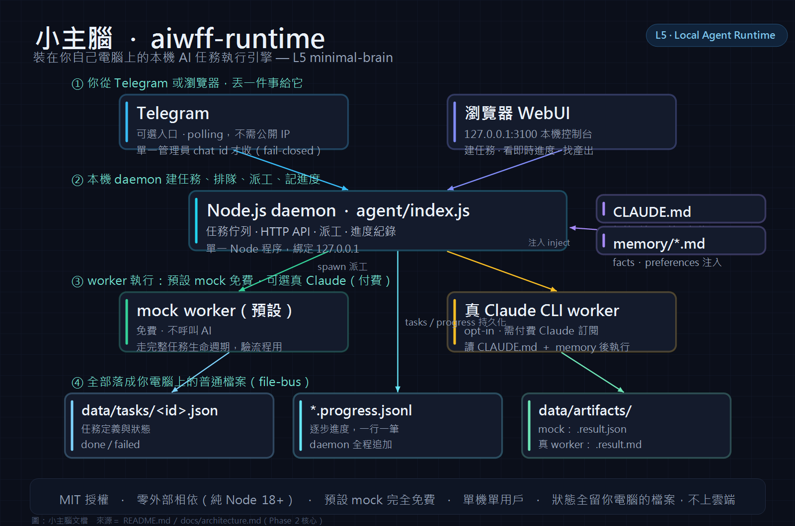
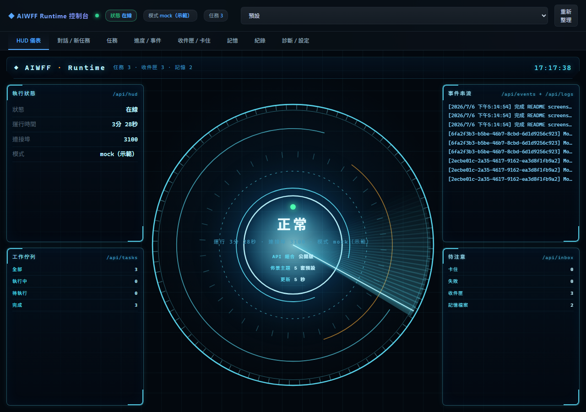
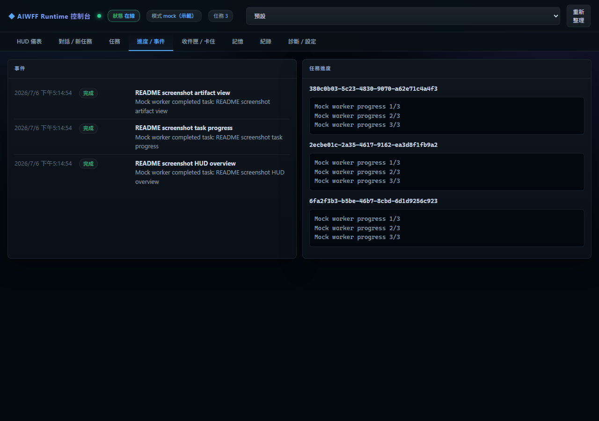
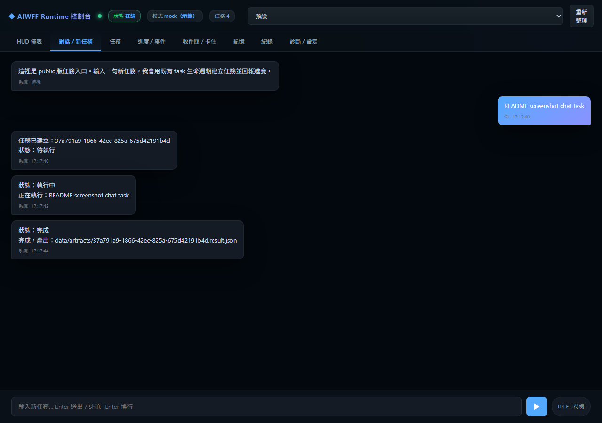

# aiwff-runtime

> English spec -> [README.md](README.md) · 安裝手冊 -> [docs/zh-TW/install.md](docs/zh-TW/install.md) · 使用手冊 -> [docs/zh-TW/usage.md](docs/zh-TW/usage.md)


[](README.zh-TW.md)

aiwff-runtime 是裝在你自己電腦上的小型 AI 任務跑台：你丟一件事，它幫你建任務、跑 worker（真正執行任務的子程序）、把結果寫成檔案。
它適合想用 Telegram（手機訊息入口）或 WebUI（瀏覽器操作畫面）交辦事情，讓 Claude CLI（命令列啟動 Claude 的工具）在本機背景做事的人。
預設 mock（不呼叫 Claude、不花錢的模擬模式）不用接外部服務；要跑真 Claude 時，再接 Claude CLI 和 Telegram。



## 這是什麼？

你可以把 aiwff-runtime 想成「單機版的小主腦」。它在你的電腦上常駐一個 daemon，也就是背景一直跑、負責收任務和派工的 Node.js 程式。你可以從 WebUI 建立任務、看進度、找結果。

先把兩個會一直出現的詞說清楚：artifact 是任務完成後留下來的成果檔；file-bus 是用一般檔案傳任務、進度和結果，不需要額外的資料庫。

| 常見誤會 | 實際情況 |
|---|---|
| 只是另一個聊天視窗 | 它會建立任務、派 worker、寫 artifact，並回報完成狀態 |
| 只是包一層模型 API | 它用你的電腦、你的檔案、你的 Claude CLI 來跑 |
| 所有步驟都要先畫成固定流程 | 它收一段任務指令後，讓 Claude 在設定邊界內規劃和用工具 |
| 任務狀態存在雲端服務 | 任務、進度、結果都存在 repo（這個專案資料夾）內的檔案裡 |

最短流程長這樣：

```text
Telegram message
  -> local daemon creates a task
  -> Claude CLI reads CLAUDE.md and runs the task
  -> result is written under data/artifacts/
  -> Telegram and WebUI show the outcome
```

## 它在 AI 工具層級裡的位置

| 層級 | 常見形態 | 那一層通常做什麼 | aiwff-runtime 的位置 |
|---|---|---|---|
| L1 | ChatGPT.com / Claude.ai | 打開聊天、回答一次、對話結束 | 在它下面 |
| L2 | API wrapper | 把模型 API 包成自己的介面 | 在它下面 |
| L3 | IDE 或 CLI assistant | 可以用工具，但狀態多半跟著單次 session | 在它下面 |
| L4 | n8n / Make / Zapier | 事先畫好的流程照路線跑 | 在它下面 |
| L5 | Local agent runtime | 收任務、規劃、用工具、保留任務狀態 | **aiwff-runtime minimal-brain** |
| L6 | Multi-node orchestration | 多台機器、多個 agent 協作 | 完整 AIWFF |

aiwff-runtime 是 L5 基底：單機、可看見、可驗證的任務執行環。完整 AIWFF 則是更大的 L6 多節點系統。

## 架構

minimal-brain 設計有 8 個元件。Phase 2 先做最實用的核心：daemon、Telegram polling（daemon 定期去查 Telegram 有沒有新訊息）、Claude CLI worker、file-bus、WebUI、`CLAUDE.md` 大腦設定、輕量 memory 注入（把記憶文字放進任務提示）。

上面的架構圖讓你先看整體關係。想看更偏 source 的對照表，請看 [docs/architecture.md](docs/architecture.md)。

| 元件 | 白話意思 | Phase 2 狀態 |
|---|---|---|
| A. Daemon | 背景常駐的 Node.js 程式，負責任務佇列、HTTP API（WebUI 用來跟 daemon 溝通的本機介面）、WebUI 和派 worker | 已在 `agent/index.js` 啟用，預設聽 `127.0.0.1:${PORT}` |
| B. TG Bot | Telegram bot 是手機上的輸入與通知出口 | 有設定 `TG_BOT_TOKEN` 時啟用；用 polling，不需要 webhook 或公開 IP |
| C. Brain | Claude CLI 被當成 worker 啟動，讀任務後用工具完成 | 透過 `CLAUDE_CMD` 啟用，預設是 `claude` |
| D. File-bus | 任務、進度、成果都用 `data/` 底下的普通檔案保存 | 已啟用：`data/tasks/`、`data/tasks/*.progress.jsonl`、`data/artifacts/` |
| E. WebUI Cockpit | 瀏覽器畫面，用來看任務狀態、建立任務、追進度、找 artifact 路徑 | 預設在 `http://127.0.0.1:3100` |
| F. Memory | Markdown 記憶檔會被塞進 Claude 的 prompt（送給模型的任務文字） | 已支援 `memory/facts.md` 和 `memory/preferences.md` |
| G. Inbox / Watching | 設計上用來放待處理事件和跨 session 提醒 | minimal-brain 設計元件；目前不當成 `.env` 功能對外說明 |
| H. Self-verify | 設計上用來做第二層完成檢查 | Phase 2 先檢查 artifact 是否存在；更完整的 Claude self-review 留到後續強化 |

<details>
<summary>純文字流程圖</summary>

```text
                 ┌────────────────────┐
                 │     Telegram       │
                 │ message / result   │
                 └─────────┬──────────┘
                           │ polling with TG_BOT_TOKEN
                           v
┌────────────┐     ┌────────────────────┐     ┌────────────────────┐
│  Browser   │<--->│  Node.js daemon    │---->│   Claude CLI worker │
│  WebUI     │     │  agent/index.js    │     │   reads CLAUDE.md   │
└────────────┘     └─────────┬──────────┘     └─────────┬──────────┘
                             │                          │
                             v                          v
                    ┌────────────────────┐     ┌────────────────────┐
                    │ data/tasks/*.json  │     │ memory/facts.md    │
                    │ progress .jsonl    │     │ memory/preferences │
                    └─────────┬──────────┘     └────────────────────┘
                              │
                              v
                    ┌────────────────────┐
                    │ data/artifacts/    │
                    │ <task>.result.md   │
                    └────────────────────┘
```

</details>

一個任務完整跑一圈會像這樣：

```text
你送出 Telegram 任務
  -> TG polling 收到訊息
  -> daemon 寫出 data/tasks/<id>.json
  -> daemon 啟動 Claude CLI
  -> Claude 讀 CLAUDE.md 和 memory 檔
  -> Claude 寫進度和結果 artifact
  -> daemon 把任務標成 done 或 failed
  -> Telegram 收到完成通知
  -> WebUI 顯示同一筆任務狀態
```

## 截圖

| HUD dashboard | Task progress | Chat / new task |
|---|---|---|
|  |  |  |

## 快速開始

### 先看你要跑到哪一層

| 層級 | 最低能跑什麼 | 需要什麼 | 沒有會怎樣 |
|---|---|---|---|
| 最低驗流程 | mock demo、WebUI、任務檔與 artifact 檢查 | Node.js 18+、git、repo clone | 沒有 Node.js 就不能啟動 daemon；沒有 git 就要用其他方式下載原始碼 |
| 真 Claude worker | 讓 Claude CLI 實際接任務、用工具、寫 `.result.md` | Claude CLI、可用的 Claude 帳號、`ENABLE_REAL_CLAUDE_WORKER=1` | 沒有就只能跑 mock；流程可驗，但不會真的叫 Claude 做事 |
| 手機交辦與通知 | 從 Telegram 丟任務、收完成通知 | Telegram bot token、你的 admin chat ID | 沒有 Telegram 仍可用 WebUI；只是不能從手機 bot 收發 |
| 進階危險模式 | 讓 Claude CLI 跳過逐次核可 | 明確設定 `CLAUDE_BYPASS_APPROVALS=1` | 沒有比較安全；會保留 Claude CLI 的核可流程 |

10 分鐘安裝：

```bash
git clone https://github.com/zaxardery8011-design/aiwff-runtime
cd aiwff-runtime
cp .env.example .env
```

如果你要接 Telegram，編輯 `.env`：

```env
TG_BOT_TOKEN=<your_bot_token>
ADMIN_TG_CHAT_ID=<your_chat_id>
```

啟動：

```bash
npm start
```

> **自訂 port / Windows 提醒：**預設 port 是 `3100`。bash、macOS、Linux 可用 `PORT=3200 npm start`；Windows PowerShell 要寫成 `$env:PORT=3200; npm start`。

接著檢查：

1. 打開 `http://127.0.0.1:3100`。
2. 如果有接 Telegram，傳任意訊息給你的 bot。
3. 確認 WebUI 出現新任務。
4. 等 Telegram 或 WebUI 顯示完成。
5. 在任務詳情裡找到 artifact 路徑。

常用本機檢查：

```bash
npm run doctor
npm run demo
npm run verify-demo
```

只想跑 mock，不呼叫 Claude CLI：

```env
MOCK_WORKER=1
```

### Codex 安裝提示詞

想讓本機 coding agent 幫你做 mock-only 安裝和驗證，可以貼這段：

```text
你是我的本機 coding agent。請幫我安裝並驗證 aiwff-runtime。

目標：
- clone 官方 repo 到本機工作資料夾
- 只跑 mock demo
- 不接 Telegram、LINE、Claude OAuth、Task Scheduler
- 不讀取、上傳或修改我的私人檔案
- 安裝完成後啟動 WebUI，並回報可開啟的 localhost URL

步驟：
1. git clone https://github.com/zaxardery8011-design/aiwff-runtime
2. cd aiwff-runtime
3. 檢查 Node.js 與 npm：node --version；npm --version。Node.js 必須 >= 18。
4. npm install
5. npm run doctor
6. MOCK_WORKER=1 npm run demo
   - PowerShell 可用：$env:MOCK_WORKER='1'; npm run demo
7. npm run verify-demo
8. npm run web
9. 回報：
   - demo task id
   - artifact path
   - verifier verdict
   - localhost URL

如果任何一步失敗，不要亂改系統、不要接 Telegram/OAuth、不要改 Task Scheduler；先停下來回報錯誤與你已執行的命令。
```

## Telegram Bot 設定

1. 打開 Telegram，搜尋 `@BotFather`。
2. 傳 `/newbot`。
3. 依提示建立 bot，複製 token。
4. 把 token 貼進 `.env` 的 `TG_BOT_TOKEN`。
5. 傳訊息給 `@userinfobot`。
6. 複製你的數字 chat ID。
7. 把它貼進 `.env` 的 `ADMIN_TG_CHAT_ID`。

有設定 `TG_BOT_TOKEN` 時，`ADMIN_TG_CHAT_ID` 也必須填。留空的話，runtime 會拒絕啟動 Telegram polling。

這套 runtime 使用 polling，也就是 daemon 主動去 Telegram 問有沒有新訊息。你不需要 webhook、公開 hostname、反向代理或公開 IP。

## 大腦設定

改 `CLAUDE.md` 就是在改 brain，也就是 Claude worker 收到任務時要遵守的個性、規矩和輸出契約。你不需要改 JavaScript。

Claude CLI 會讀 repo 根目錄的 `CLAUDE.md`。Phase 2 的 daemon 也會把這些內容一起放進 prompt：

- `memory/facts.md`
- `memory/preferences.md`
- 任務標題、任務指令、task ID
- 必須寫入的 artifact 路徑
- 最後一行必須符合 `DONE: ...` 的完成契約

最小 `CLAUDE.md` 範本：

```markdown
# Agent Configuration

You are the user's local AI assistant. When you receive a task, do not only answer.
Use tools and execute the task until it is complete.

## Execution Rules
1. Understand the intent, not only the literal wording.
2. Use tools to complete the task: Read / Write / Edit / Bash / Glob / Grep.
3. Save the result to `data/artifacts/<task_id>.result.md`.
4. The final line must be: `DONE: <one sentence describing what you completed>`.

## Boundaries
- Do not modify `.env` or credential files.
- Do not make external network requests unless the task explicitly asks for them.
- If you do not know how to complete the task, say so in progress. Do not pretend it is done.

## Working Directory
{project_root}
```

你可以調的東西：

| 想調什麼 | 例子 |
|---|---|
| 做事語氣 | "Prefer concise status updates and source-bound claims." |
| 安全邊界 | "Never edit credential files or delete user data." |
| 輸出契約 | "Always write a Markdown report and end with `DONE:`." |

預先寫好的 persona，也就是可套用的工作角色範本，放在 [templates/claude/](templates/claude/)：dev partner、research assistant、daily helper。

## 設定檔

把 `.env.example` 複製成 `.env` 後再改。`.env` 是本機設定檔，通常不應該提交到 git。

目前 `.env.example` 有這些欄位：

| 變數 | 必填？ | 預設 / 空值 | 誰會讀 | 說明 |
|---|---:|---|---|---|
| `PORT` | 否 | `3100` | `agent/index.js` | daemon 和 WebUI 使用的 HTTP port |
| `TG_BOT_TOKEN` | Telegram 模式必填 | 空 | `agent/index.js` | `@BotFather` 給你的 Telegram Bot token；留空時 WebUI 仍可跑，但不啟動 TG polling |
| `ADMIN_TG_CHAT_ID` | 有設 `TG_BOT_TOKEN` 時必填 | 空 | `agent/index.js` | 只接受這個 admin chat 的 Telegram 訊息 |
| `CLAUDE_CMD` | 否 | `claude` | `agent/index.js` | 啟動 Claude CLI 的命令；Windows 會透過 `cmd.exe` 解析 `claude.cmd` |
| `MOCK_WORKER` | 否 | `1` | `agent/index.js` | 對外安全預設：使用 mock worker，不呼叫 Claude CLI |
| `ENABLE_REAL_CLAUDE_WORKER` | 真 Claude worker 必填 | 空 | `agent/index.js` | 只有你真的要讓 Claude CLI 執行任務時才設成 `1` |
| `CLAUDE_BYPASS_APPROVALS` | 危險模式選填 | 空 | `agent/index.js` | 只有你明確想讓 `claude --print` 加上 `--dangerously-skip-permissions` 時才設成 `1` |

真 Claude 模式下，daemon 會把任務 prompt 從 stdin 送給 Claude，而不是塞進 argv。stdin 是標準輸入；這樣比較不容易踩到長 prompt 或引號轉義問題，同時保留 stdout 串流進度。stdout 是標準輸出，也就是 CLI 往外印進度的地方。

目前 `.env.example`：

```env
PORT=3100
TG_BOT_TOKEN=
ADMIN_TG_CHAT_ID=
CLAUDE_CMD=claude
MOCK_WORKER=1
ENABLE_REAL_CLAUDE_WORKER=
CLAUDE_BYPASS_APPROVALS=
```

`WORK_DIR` 出現在設計草稿裡，但目前 `.env.example` 沒有這個欄位，Phase 2 runtime 也不讀它。

## 和完整 AIWFF 的差別

這個 repo 的取捨很簡單：先把多節點複雜度拿掉，保留單機 agent loop，讓人看得懂、跑得起來、查得到狀態。

| 面向 | 完整 AIWFF | aiwff-runtime minimal-brain |
|---|---|---|
| 大腦設定 | 多檔治理堆疊，包含身份、邊界和操作規則 | 一個 `CLAUDE.md` 放身份、邊界、規則和輸出契約 |
| 跨 session 記憶 | 結構化記憶、frontmatter、沉澱與去重 | 輕量 Markdown memory 檔注入 prompt |
| 任務治理 | inbox、watching、patrol、backlog SSOT | minimal design target：簡化的 inbox 和 watching surface |
| 節點規模 | 主腦機器 + 其他節點 + 跨機 dispatch | 單機 |
| 外部諮詢 | Gemini / Codex / 其他 advisory workers | 未來可擴充，不是 Phase 2 必要條件 |
| 自我驗證 | 多 agent review 與更強治理檢查 | 目前先檢查 artifact 是否存在；完整 self-review 留到 hardening |
| 操作介面 | TG、LINE、WebUI 等更多介面 | Phase 2 是 TG + WebUI |
| 安裝難度 | 高，因為治理模型大 | 低，主要面對 `.env` 和 `CLAUDE.md` |

## 誠實限制

這些限制刻意不美化。

| 限制 | 意思 |
|---|---|
| 真 worker 需要 Claude 訂閱 | mock 模式免費；真 Claude worker 取決於付費 Claude 帳號與 CLI 權限 |
| 單人使用設計 | 一個 Telegram bot 綁一個 admin chat ID；它不是多人客服系統 |
| 沒有多節點 fleet | 這個 runtime 跑在一台機器上，不協調一整組機器 |
| Windows PATH 設定 | Windows 上需要讓 `claude.cmd` 可以從 PATH 找到 |
| Memory 是文字注入，不是 RAG | RAG 是先檢索資料再餵給模型的做法；這裡先把 Markdown 記憶直接放進 context，大檔會吃上下文，所以 `memory/facts.md` 要保持精簡 |
| 不適合超長任務 | 超過約 10 分鐘的任務沒有 checkpoint resume（中途記點、下次接著跑）；更重的工作流由完整 AIWFF 處理 |

## Roadmap

| Phase | 狀態 | 範圍 |
|---|---|---|
| Phase 1 | Done | Mock-first task lifecycle、local file-bus、WebUI、demo verification |
| Phase 2 | PR branch / 尚未合併成公開 baseline | Claude CLI worker、TG Bot polling、`CLAUDE.md` brain configuration、lightweight memory injection |
| Phase 3 | Planned | Memory Layer hardening：更好的抽取、整理和長期 context 管理 |

在這個 PR merge 前，公開 `master` baseline 仍是 Phase 1。Phase 2 是目前 PR branch 的範圍。

## 支援

- 技術回報：GitHub Issues -> <https://github.com/zaxardery8011-design/aiwff-runtime/issues>。如果目前無法建立 issue，請改從 <https://zax.com.tw> 聯絡。
- 完整版 / 客製化：<https://zax.com.tw>

## Related — 守紀律工具鏈

aiwff-runtime 是**引擎**——真的能跑得動你的 agent 的 local runtime。想讓它跑起來以後還守紀律？搭配這兩個護欄：

- **[soplint](https://github.com/zaxardery8011-design/soplint)** — 靜態掃描 AI 工作節點的 SOP 紀律合規
- **[execution-proofs](https://github.com/zaxardery8011-design/execution-proofs)** — MCP telemetry gateway：逼 agent 用真實檔案與時間戳證明「做完了」
- **[aiwff-runtime](https://github.com/zaxardery8011-design/aiwff-runtime)** — the local agent runtime（本專案）

> 引擎（跑得動的 agent）＋護欄（審紀律、逼證明），同一套「讓 AI 守紀律」哲學的兩面。

## License

MIT
