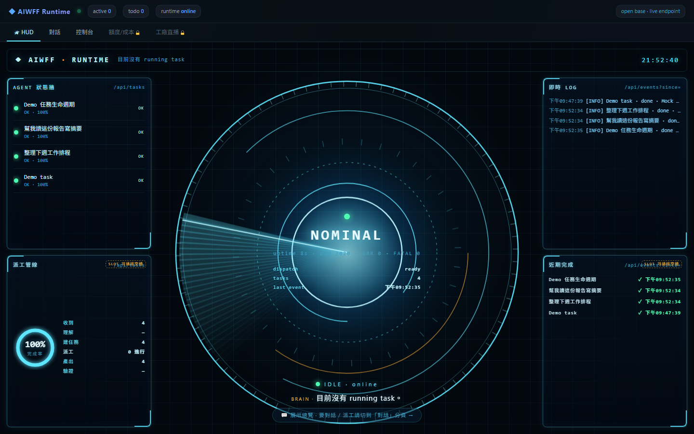
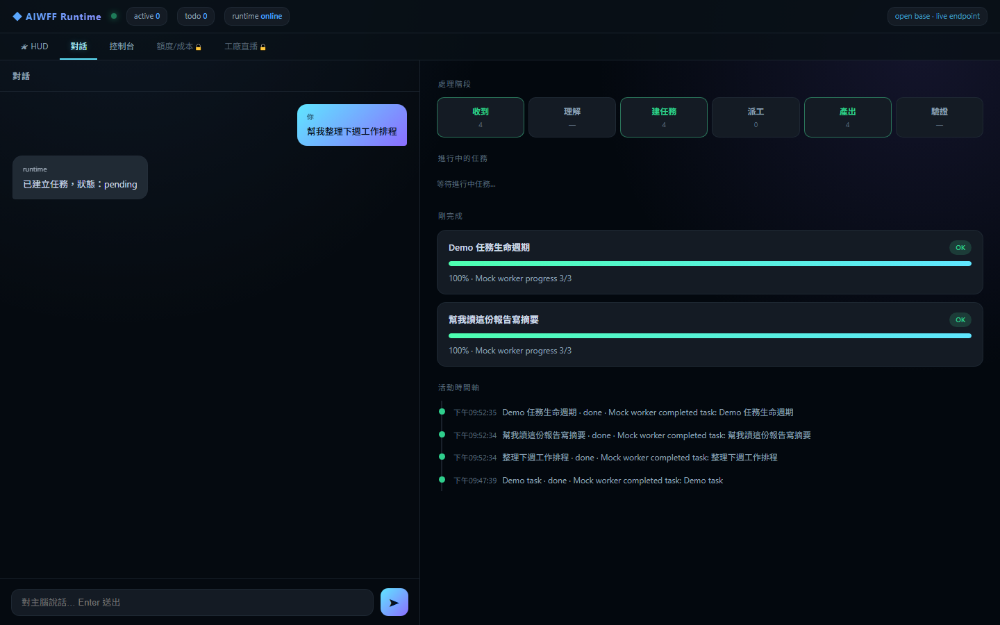
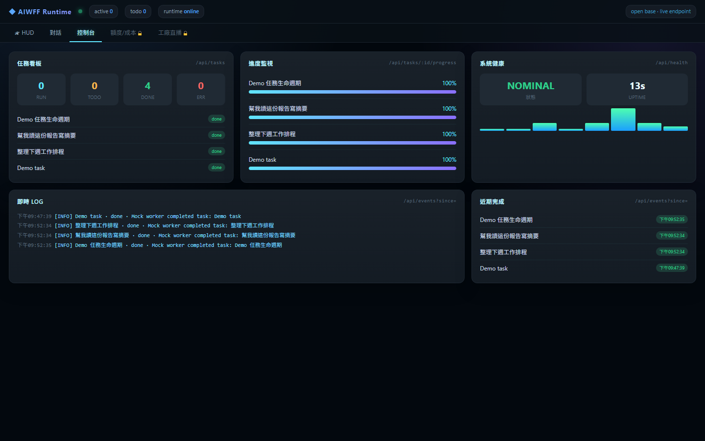

# 小主腦 使用手冊

> 小主腦（專案名 `aiwff-runtime`）＝裝在你自己電腦上的小型 AI 主腦。
>
> 這份是**使用手冊**，教你裝好之後怎麼用它、產出在哪、怎麼調它的個性。還沒裝好，請先看 [安裝手冊 install.md](install.md)。
> 英文完整規格 → [../../README.md](../../README.md)。

---

## §1 三種操作面總覽

小主腦有三個入口可以「丟事情給它、看它做完」。同一套後端、同一份 `data/`，只是三種摸它的方式：

| 操作面 | 怎麼開 | 適合什麼情境 | 需要額外設定嗎 |
|---|---|---|---|
| **WebUI 控制台** | 瀏覽器開 `http://127.0.0.1:3100`（見 §2） | 平常主力：建任務、看即時進度、看產出路徑，一個畫面全包 | 不需要，裝完就有 |
| **Telegram** | 手機傳訊息給你的 bot（見 §3、安裝手冊 §4） | 人不在電腦前，想用手機丟一句話、收完成通知 | 要先接 Telegram（填 token + chat id） |
| **demo 腳本** | 終端機 `npm run demo` | 只想快速確認「流程還通不通」，不想開瀏覽器 | 不需要，走 mock |

一句話分流：**日常操作用 WebUI，出門在外用 Telegram，除錯自檢用 demo 腳本。** 三者背後是同一個 daemon、同一批任務檔，你在 WebUI 建的任務，`npm run demo` 之外的 CLI 也看得到。

下面是 WebUI 控制台首頁（HUD 分頁）的實際樣子——這張是在 mock 模式、跑完幾個示範任務後截的：



---

## §2 用 WebUI 建立與追蹤任務

確定 daemon 有在跑（終端機 `npm run web`，看到 `AIWFF Runtime listening on http://127.0.0.1:3100`），瀏覽器打開那個網址。控制台頂端有三個可用分頁：**🛰 HUD**、**對話**、**控制台**（「額度/成本」「工廠直播」目前是鎖住的預留位）。

### 2.1 建立任務（「對話」分頁）

切到 **對話** 分頁，左邊是對話框，下方輸入列打一句你要它做的事、按 Enter（或點 ➤）就送出。送出後它會即時回你「已建立任務，狀態：pending」，右邊的「處理階段」管線與「剛完成 / 活動時間軸」會跟著動：



> 背後發生的事：送出等於對 `POST /api/tasks` 建了一筆任務，daemon 立刻派 mock worker 去跑，產出寫進 `data/artifacts/`（詳見 §4 的檔案地圖）。

### 2.2 看即時進度（「HUD」分頁）

**HUD** 分頁是一眼看全局的儀表：中央反應爐顯示系統狀態（`NOMINAL` = 正常）、左側「AGENT 狀態牆」列出每個任務與完成度、右上「即時 LOG」滾動事件、右下「近期完成」與左下「派工管線／完成率」。任務跑完，完成率會走到 100%：

（首頁截圖見 §1 上方那張 HUD。）

### 2.3 看任務看板與產出（「控制台」分頁）

**控制台** 分頁把資料攤成表格，最適合追蹤與除錯：

- **任務看板**：RUN / TODO / DONE / ERR 四個數字 + 任務清單與狀態。
- **進度監視**：每個任務一條進度條（mock 任務跑完是 100%）。
- **系統健康**：`/api/health` 的狀態與 uptime。
- **即時 LOG / 近期完成**：事件流與最近完成的任務。



### 2.4 找到某個任務的產出檔

任務完成後，成品是 `data/artifacts/<task_id>.result.json`（mock 模式）。你可以：

- 直接到 `data/artifacts/` 資料夾，依修改時間找最新的檔；或
- 用終端機 `npm run verify-demo`，它會抓最新的 `.result.json` 並印出完整路徑。

打開這個 JSON，會看到 `task_id`、`title`、`summary`、`completed_at` 幾個欄位——這就是 mock 模式的「產出長相」（真 worker 的產出是 `.result.md`，格式不同，見 §5）。

---

## §3 用 Telegram 丟任務、收結果

Telegram 讓你人不在電腦前，也能用手機丟任務、收通知。**這是可選功能**，要先照 [安裝手冊 §4](install.md) 把 `TG_BOT_TOKEN` 與 `ADMIN_TG_CHAT_ID` 填進 `.env`。

### 3.1 接好之後怎麼用

| 你傳給 bot | 它做什麼 |
|---|---|
| `/start` | 回一句「主腦已上線」，確認連上了 |
| `/tasks` | 列出最近 5 筆任務與狀態 |
| 任何其他文字 | 當成任務指令，建一筆任務去跑，先回「✅ 收到，任務建立」，跑完再推完成 / 失敗通知 |

只有 `.env` 裡 `ADMIN_TG_CHAT_ID` 那個 chat id 傳的訊息會被接受，別人傳的會被忽略——這是**單一管理員**設計（見 [§7.1 限制](#71-這些限制刻意不美化)）。

### 3.2 最常見的坑：chat id 留空 → 拒絕啟動（本手冊已實測）

如果你只填了 `TG_BOT_TOKEN` 卻把 `ADMIN_TG_CHAT_ID` 留空，daemon **會拒絕啟動 Telegram polling**（避免 bot 對任何人都開放）。啟動時終端機會印出這行：

```text
Refusing Telegram polling: ADMIN_TG_CHAT_ID is required when TG_BOT_TOKEN is set.
AIWFF Runtime listening on http://127.0.0.1:3100
```

> 上面這段是用**假 token + 空 chat id** 實測到的真實輸出：WebUI 照常起，但 Telegram 就是不會啟動。看到這行，就去 `.env` 把 `ADMIN_TG_CHAT_ID` 補上你的數字 chat id（用 `@userinfobot` 取得），存檔重跑即可。

### 3.3 端到端收發（真 bot）——尚待定稿

用**真的** Telegram bot token 傳訊息、手機收到完成通知的完整端到端流程，需要你自己去 `@BotFather` 申請真 bot、拿真 chat id 才能驗，屬使用者手動步驟，本手冊的乾淨機實測（mock 路徑）不接真 bot，故這段的逐步截圖與收發時序**另議**、待真帳號實測後補上。上面 3.1 的指令介面與 3.2 的負向保護邏輯，都已在 mock 環境驗證屬實。

---

## §4 任務生命週期與檔案都在哪（file-bus）

小主腦刻意把每個環節都寫成**你電腦上的普通檔案**，沒有藏在雲端、也沒有藏在資料庫裡。你隨時可以打開來看。

一個任務走完完整一圈是這樣：

```text
你交代一件事（WebUI 或 Telegram）
  -> 本機 daemon 建立任務，寫出 data/tasks/<id>.json
  -> daemon 逐步寫進度到 data/tasks/<id>.progress.jsonl
  -> daemon 派 worker（mock 或真 Claude）執行
  -> 產出寫進 data/artifacts/
  -> daemon 把任務標記 done（或 failed）
  -> WebUI（與可選的 Telegram）看得到最終狀態
```

對應的檔案位置：

| 檔案 / 目錄 | 裝的是什麼 | 什麼時候出現 |
|---|---|---|
| `data/tasks/<id>.json` | 這個任務的定義與狀態（title、instruction、status…） | 任務一建立就有 |
| `data/tasks/<id>.progress.jsonl` | 這個任務的逐步進度紀錄（一行一筆） | 任務執行過程中持續追加 |
| `data/artifacts/<id>.result.json` | **mock 模式**的產出 | mock worker 跑完 |
| `data/artifacts/<id>.result.md` | **真 Claude worker** 的產出（依 `CLAUDE.md` 契約寫成 Markdown） | 真 worker 跑完 |

> **狀態值**：任務會經過 `done`（完成）或 `failed`（失敗）。要判斷「這件到底做完沒」，就看 `data/tasks/<id>.json` 裡的 `status`。
>
> **一個實用習慣**：任務出問題時，先開 `data/tasks/<id>.progress.jsonl` 從頭讀一遍，通常能直接看到卡在哪一步。

---

## §5 讀懂產出（artifact）

同一件事，mock 模式和真 worker 模式產出的**檔案格式不一樣**，先知道差別就不會找錯檔：

### 5.1 mock 模式：`<id>.result.json`

- 副檔名是 **`.result.json`**（結構化 JSON，不是給人閱讀的散文）。
- 至少會有 `task_id`、`completed_at` 等欄位；`npm run verify-demo` 就是靠檢查這個檔存在、非空、且 `completed_at` 有值，來判定 demo 跑成功。
- 用途：確認「流程跑得通」，不是真的 AI 回答。

### 5.2 真 Claude worker：`<id>.result.md`

- 副檔名是 **`.result.md`**（Markdown，給人讀的報告）。
- 這是真 Claude 依專案根目錄 `CLAUDE.md` 的輸出契約寫的：讀懂任務 → 用工具做完 → 把結果存到 `data/artifacts/<task_id>.result.md` → 最後一行寫 `DONE: <一句話說完成了什麼>`。
- 看到最後那行 `DONE:`，就是這個 worker 自報完成的訊號。

### 5.3 怎麼找到最新一筆產出

- WebUI 的任務詳情面板會直接顯示該任務的 artifact 路徑。
- 或直接到 `data/artifacts/` 目錄，依修改時間找最新的檔（`verify-demo` 內部也是抓最新的 `.result.json`）。

> **提醒**：artifact 是「這次任務的成品」，`progress.jsonl` 是「做這件事的過程」。要成果看 artifact，要追過程看 progress。

---

## §6 調整個性（CLAUDE.md）與記憶（memory/）

小主腦的「個性」和「記憶」都是**純文字檔**，改檔就改行為，不用碰任何 JavaScript 程式碼。

### 6.1 用 `CLAUDE.md` 決定它的個性與規矩

- 真 Claude worker 每次執行，都會讀專案根目錄的 `CLAUDE.md`。改這個檔 = 改大腦的行為。
- 你可以在裡面調三類東西：

| 想調什麼 | 例子 |
|---|---|
| 講話 / 做事風格 | 「回報要精簡，只講有來源可查的結論。」 |
| 安全邊界 | 「絕不修改任何 credentials 檔，絕不刪使用者資料。」 |
| 產出格式 | 「一律寫成 Markdown 報告，並以 `DONE:` 結尾。」 |

- 不想從空白開始？專案的 [`templates/claude/`](../../templates/claude/) 準備了幾套現成人格（開發夥伴 `persona_dev_partner.md`、研究助理 `persona_research_assistant.md`、生活秘書 `persona_daily_helper.md`）——挑一套、把內容複製進你 repo 根目錄的 `CLAUDE.md`，助理就照那個個性回應。

### 6.2 用 `memory/` 給它跨任務的記憶

- 真 worker 執行時，daemon 會把記憶檔的內容注入 Claude 的提示，讓它「記得」你之前交代過的事實與偏好。
- 目前注入的記憶檔：
  - `memory/facts.md`（事實：關於你、你的專案的固定資訊）
  - `memory/preferences.md`（偏好：你希望它怎麼做事）
- 這是**輕量的文字注入**，不是資料庫檢索（RAG）。所以：**記憶量越大，注入的內容越多、context 越撐**。建議定期整理 `memory/` 下的檔案，只留真正重要的。

> 邊界提醒：`CLAUDE.md` 裡設的安全邊界（例如「不改 `.env`」）是給 worker 的行為約束；它和安裝時的環境設定（`.env`）是兩回事，別搞混。

---

## §7 誠實的限制與疑難排解

### 7.1 這些限制刻意不美化

| 限制 | 說明 |
|---|---|
| 單用戶設計 | 一個 Telegram bot 只綁一個管理員 chat id，不適合多人共用 |
| 只跑單台機器 | 沒有多節點派工，就是你這台電腦上的一個 agent 迴圈 |
| 記憶是文字注入非 RAG | 記憶量大時 context 會撐大，建議定期整理 `memory/` 下的檔案 |
| 不適合超長任務 | 超過約 10 分鐘的任務沒有斷點續傳機制 |
| Windows PATH | 用真 Claude worker 時，要確認系統 PATH 找得到 `claude.cmd` |

### 7.2 使用時常見狀況

| 症狀 | 處理方式 |
|---|---|
| 任務一直卡在沒完成 | 開 `data/tasks/<id>.progress.jsonl` 看卡在哪一步；超過約 10 分鐘的長任務本工具無斷點續傳 |
| 找不到產出檔 | mock 找 `data/artifacts/<id>.result.json`，真 worker 找 `<id>.result.md`；或看 WebUI 任務詳情裡的路徑 |
| 改了 `CLAUDE.md` 但行為沒變 | 確認你改的是 repo 根目錄那個 `CLAUDE.md`，且用的是真 worker（mock 不讀個性） |
| 記憶好像沒被記得 | 確認事實寫在 `memory/facts.md`、偏好寫在 `memory/preferences.md`，且跑的是真 worker |

### 7.3 支援管道

- **技術支援（唯一管道）**：GitHub Issues → <https://github.com/zaxardery8011-design/aiwff-runtime/issues>
- **想要完整版 / 客製化**：<https://zax.com.tw>

---

*小主腦（`aiwff-runtime`）· MIT 授權 · 本手冊標示 [TODO] 者，待實測 / 截圖後定稿。*
